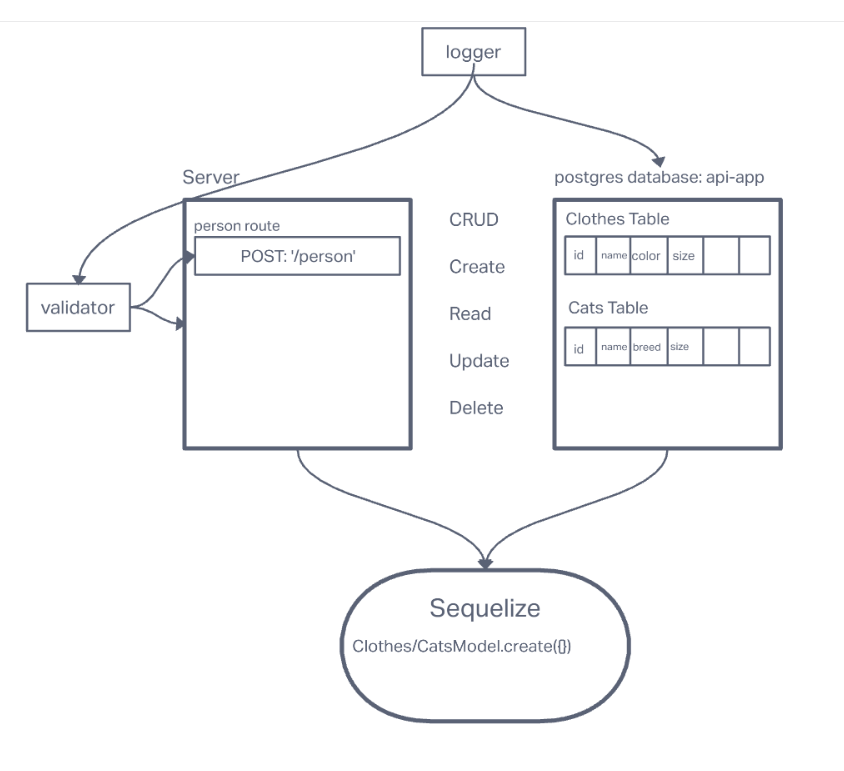

# BASIC API SERVER

## Author: Luis Rosales

[Prod Deployed Server](https://rosales-basic-api-server.herokuapp.com/)
## Problem Domain

A basic api server inteded to practice server modularization, use of middleware, routes, CRUD, writing tests and overall best practices.

## Dependencies

* node
* dotenv
* express
* jest
* supertest
* sqlite3
* sequelize-cli
* sequelize
* pg

### Setup

* npm init
* env
* npm i dotenv, supertest, jest, express, pg, sequelize, sequelize-cli, sqlite3

### Tests

* 404 on a bad route
* 404 on a bad method
* The correct status codes and returned data for each REST route
* Create a record using POST
* Read a list of records using GET
* Read a record using GET
* Update a record using PUT
* Destroy a record using DELETE

### UML

